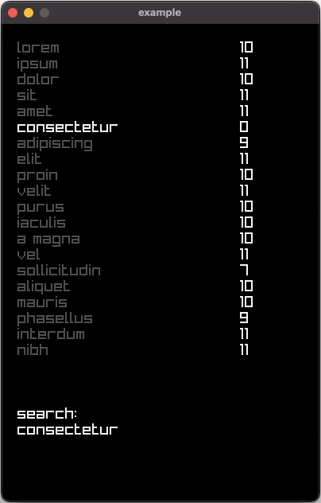

# fuzzy_search

This is a library for fuzzy search. Matching a string uses its Levenshtein distance, which is calculated using three basic operations: insertion, deletion, and substitution.

## Example

Code example:

```
size_t close_match = 3;

char str[] = "consectet";
size_t match = fsearch(str, "consectetur");

if (match < close_match) printf("close match!");
```

Application example:



## Compiling

Compiling the library (run in root directory):

```
make RELEASE=1
```

This should create out/release/libfsearch.a.

Compiling and running tests (run in root directory):

```
make
cd tests
make
out/lev_dist.test && out/fsearch.test
```

Compiling and running benchmarks (run in root directory):

```
make
cd bench
make
out/lev_dist.bench && out/fsearch.bench
```

Compiling and running example (run in root directory):

```
make RELEASE=1
cd example
make
out/debug/example
```